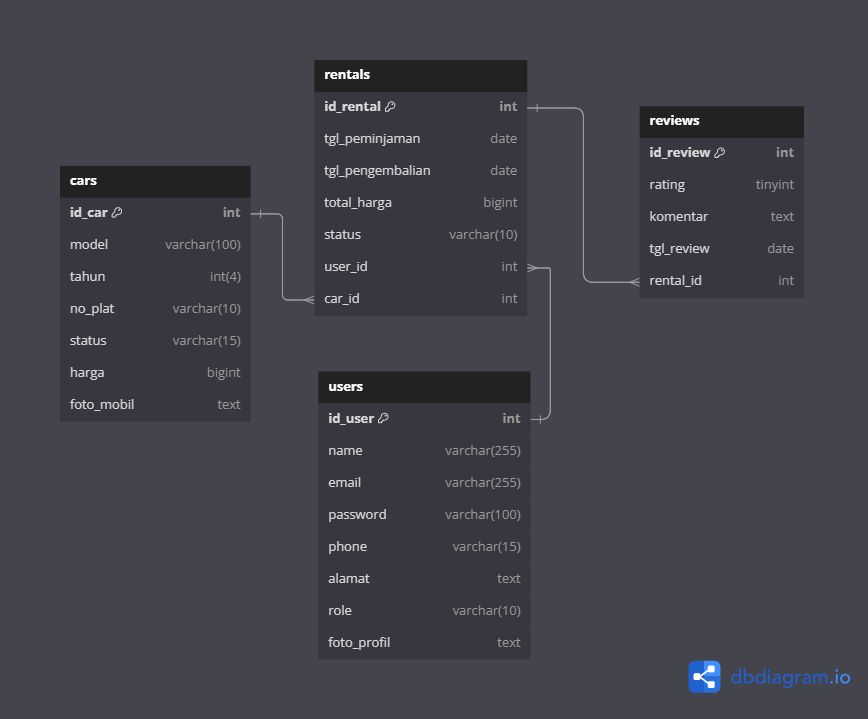

# 🚗 Backend CRUD Rental Mobil - Aplikasi Dashboard

Proyek ini adalah **Backend** untuk aplikasi **dashboard CRUD rental mobil**, yang dibangun dengan **Express.js** dan menggunakan **PostgreSQL**. Aplikasi ini menyediakan fitur manajemen pengguna, mobil, rental, serta review, termasuk registrasi pengguna dan unggah file gambar mobil dan foto profile user menggunakan **ImageKit**

## 📄 DataBase ERD
.

## 📋 Fitur Utama

- **Registrasi Pengguna**: Pengguna dapat mendaftar.
- **Manajemen Pengguna (CRUD User)**: Admin dapat menambah, mengedit, melihat, dan menghapus data pengguna.
- **Manajemen Mobil (CRUD Cars)**: Admin dapat mengelola daftar mobil (CRUD mobil), termasuk fitur upload gambar.
- **Manajemen Rental Mobil (CRUD Rentals)**: Pengguna dapat menyewa mobil, melihat riwayat rental, dan admin dapat mengelola rental.
- **Review Mobil (CRUD Reviews)**: Pengguna dapat memberikan ulasan terhadap mobil yang mereka sewa.
- **Upload File**: Pengunggahan gambar mobil dan foto profile user dengan penyimpanan berbasis cloud menggunakan **ImageKit**.

## 🛠️ Teknologi yang Digunakan

- **Backend**: Node.js, Express.js
- **Database**: PostgreSQL, Sequelize ORM
- **Upload File**: Multer, ImageKit
- **Dokumentasi API**: Postman

## 🚀 Memulai

### Prasyarat

- [Node.js](https://nodejs.org/) (v14+)
- [PostgreSQL](https://www.postgresql.org/)
- [ImageKit](https://imagekit.io/) (untuk penyimpanan gambar di cloud)

### Instalasi

1. Clone repository ini:

   ```bash
   git clone https://github.com/username/rental-mobil-backend.git
   ```

2. Instal semua dependensi:

   ```bash
   cd rental-mobil-backend
   npm install
   ```

3. Buat file `.env` dengan variabel lingkungan berikut:

   ```bash
   DB_USERNAME=your_db_username
   DB_PASSWORD=your_db_password
   DB_NAME=your_db_name

   PUBLIC_KEY=your_imagekit_public_key
   PRIVATE_KEY=your_imagekit_private_key
   URL_ENDPOINT=your_imagekit_url_endpoint
   ```

4. Siapkan database PostgreSQL dan jalankan migrasi:

   ```bash
   npx sequelize db:create
   npx sequelize db:migrate
   ```

### Menjalankan Aplikasi

Untuk memulai server dalam mode pengembangan:

```bash
npm run dev
```

## 📂 Route

### Health Check

| Method | Route                           | Deskripsi                          |
|--------|---------------------------------|------------------------------------|
| GET    | `/dashboard/health-check`       | Memeriksa status kesehatan server  |

### Manajemen Pengguna (CRUD Users)

| Method | Route                                     | Deskripsi                          |
|--------|-------------------------------------------|------------------------------------|
| GET    | `/dashboard/users/`                      | Mengambil semua data pengguna      |
| GET    | `/dashboard/users/detail/:id`            | Mengambil detail pengguna berdasarkan ID |
| GET    | `/dashboard/users/create`                | Menampilkan form tambah pengguna   |
| POST   | `/dashboard/users/`                      | Menambah pengguna baru beserta foto profil |
| GET    | `/dashboard/users/edit/:id`              | Menampilkan form edit pengguna     |
| POST   | `/dashboard/users/:id`                   | Memperbarui data pengguna          |
| GET    | `/dashboard/users/delete/:id`            | Menghapus pengguna tertentu        |

### Manajemen Mobil (CRUD Cars)

| Method | Endpoint                                 | Deskripsi                          |
|--------|-------------------------------------------|------------------------------------|
| GET    | `/dashboard/cars/`                       | Mengambil semua data mobil         |
| GET    | `/dashboard/cars/detail/:id`             | Mengambil detail mobil berdasarkan ID |
| GET    | `/dashboard/cars/create`                 | Menampilkan form tambah mobil      |
| POST   | `/dashboard/cars/`                       | Menambah mobil baru beserta gambar |
| GET    | `/dashboard/cars/edit/:id`               | Menampilkan form edit mobil        |
| POST   | `/dashboard/cars/edit/:id`               | Memperbarui data mobil beserta gambar |
| GET    | `/dashboard/cars/delete/:id`             | Menghapus mobil tertentu           |

### Manajemen Rental (CRUD Rentals)

| Method | Endpoint                                 | Deskripsi                          |
|--------|-------------------------------------------|------------------------------------|
| GET    | `/dashboard/rentals/`                    | Mengambil semua data rental        |
| GET    | `/dashboard/rentals/:id`                 | Mengambil detail rental berdasarkan ID |
| GET    | `/dashboard/rentals/create`              | Menampilkan form tambah rental     |
| POST   | `/dashboard/rentals/create`              | Menambah rental baru               |
| GET    | `/dashboard/rentals/update/:id`          | Menampilkan form edit rental       |
| POST   | `/dashboard/rentals/update/:id`          | Memperbarui data rental            |
| GET    | `/dashboard/rentals/delete/:id`          | Menghapus rental tertentu          |

### Manajemen Review (CRUD Reviews)

| Method | Endpoint                                 | Deskripsi                          |
|--------|-------------------------------------------|------------------------------------|
| GET    | `/dashboard/reviews/`                    | Mengambil semua data review        |
| GET    | `/dashboard/reviews/detail/:id`          | Mengambil detail review berdasarkan ID |
| GET    | `/dashboard/reviews/create-review`       | Menampilkan form tambah review     |
| POST   | `/dashboard/reviews/create-review`       | Menambah review baru               |
| GET    | `/dashboard/reviews/update-review/:id`   | Menampilkan form edit review       |
| POST   | `/dashboard/reviews/update-review/:id`   | Memperbarui data review            |
| GET    | `/dashboard/reviews/delete/:id`          | Menghapus review tertentu          |


## 🤝 Kontribusi

Daftar Anggota Dalam Repository Ini

1. **[Nita Fitrotul Mar'ah](https://github.com/Nitaa1904)** Read user, Detail user, Delete user
2. **[Rafly Aziz Abdillah](https://github.com/raflytch)** create user, Update user
3. **[Wahyu Anang Zulfikri](https://github.com/wahyuanang)** Read cars, Detail cars, Delete cars
4. **[Ahmad Alif Ramadhan](https://github.com/neobitose)** Create cars, Update cars
5. **[Gede Brandon Abelio Ogaden](https://github.com/OddDuckkk)** Read rentals, Detail rentals, Delete rentals 
6. **[Jetro Sulthan Fatih Nurrafi](https://github.com/JetroSulthan)** Create rentals, Update rentals
7. **[Tegar Alfa Rizzi](https://github.com/TegarAlfaR)** Read reviews, Detail reviews, Delete reviews
8. **[Muhammad Rifqi Tri Afandi](https://github.com/RifqiAfandi)** Create reviews & Update reviews

## Teknologi yang Digunakan

- **Node.js**: Runtime untuk backend.
- **Express.js**: Framework web untuk Node.js.
- **ImageKit**: Penyimpanan cloud untuk gambar.
- **Sequelize**: ORM untuk PostgreSQL.
- **Multer**: Middleware untuk menangani `multipart/form-data` untuk upload file.